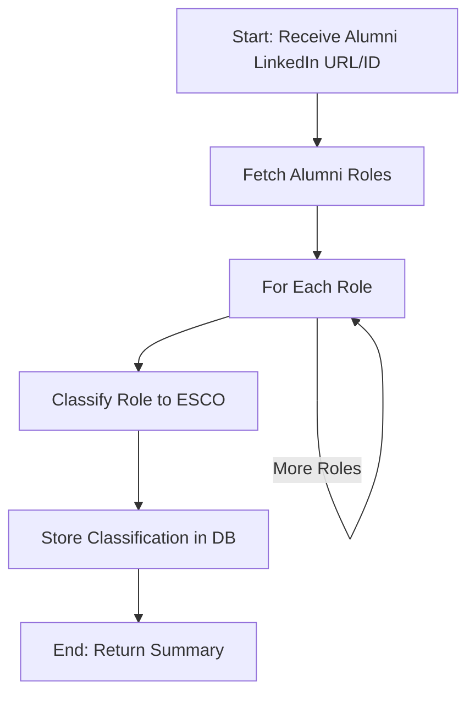

# Alumni Role Classification Agent Workflow

## Overview

This document outlines the workflow and tools for the agent responsible for classifying alumni roles into the ESCO (European Skills, Competences, Qualifications and Occupations) taxonomy.

## Agent Workflow



## Tools Required

### 1. Fetch Alumni Roles Tool
- **Input**: LinkedIn URL or alumni ID
- **Operation**: Database query to retrieve all roles associated with this alumni
- **Output**: List of roles with titles, descriptions, companies, and other relevant data
- **Implementation**: SQL query to join `alumni`, `role`, and possibly `role_raw` tables

```python
async def fetch_alumni_roles(alumni_id=None, linkedin_url=None):
    """
    Fetch all roles for a given alumni by ID or LinkedIn URL
    Returns a list of roles with all relevant data for classification
    """
    # Query the database to get roles
    # Return structured role data
```

### 2. ESCO Taxonomy Classification Tool
- **Input**: Role title and description
- **Operation**: Using LLM to classify into appropriate ESCO category
- **Output**: ESCO code, level, title, and confidence score
- **Implementation**: LangChain agent with reasoning steps

```python
async def classify_role_to_esco(role_title, role_description, company_name=None):
    """
    Classify a role into the ESCO taxonomy using an LLM agent
    Returns ESCO classification details
    """
    # Implement classification logic using LangChain
    # Return ESCO classification details
```

### 3. ESCO Reference Tool
- **Input**: Search query or filter criteria
- **Operation**: Retrieves relevant ESCO classifications that match certain criteria
- **Output**: List of matching ESCO classifications with details
- **Implementation**: Vector database for semantic search or filtered SQL query

```python
async def search_esco_classifications(query=None, filters=None, limit=10):
    """
    Search for relevant ESCO classifications based on query or filters
    Returns matching ESCO classifications
    """
    # Implement search logic
    # Return matching ESCO classifications
```

### 4. Store Classification Tool
- **Input**: Role ID, ESCO classification details
- **Operation**: Inserts classification results into the database
- **Output**: Success/failure and the stored record ID
- **Implementation**: SQL insert into `job_classification` table

```python
async def store_job_classification(role_id, esco_code, esco_level, title, confidence):
    """
    Store job classification result in the database
    Returns the ID of the stored classification
    """
    # Implement database insertion
    # Return success/failure and record ID
```

## Prompt Engineering Ideas

### System Prompt for ESCO Classification

```
You are an expert employment and job classification specialist with deep knowledge of the European Skills, Competences, Qualifications and Occupations (ESCO) taxonomy.

Your task is to analyze job titles and descriptions and accurately classify them according to the ESCO taxonomy level 14 occupations.

The ESCO taxonomy is a hierarchical system that categorizes occupations in Europe. Leel 4 represents broad occupational categories.

Follow these steps for classification:
1. Analyze the job title and description carefully
2. Consider the industry context and company information
3. Research the most appropriate ESCO classification if needed
4. Provide your classification with a confidence score

Always explain your reasoning process to ensure transparency in your decision-making.
```

### Tool Descriptions

```
fetch_alumni_roles: Use this tool to retrieve all professional roles associated with an alumni profile. Input can be either an alumni ID or LinkedIn URL.

search_esco_classifications: Use this tool to search for relevant ESCO classifications based on keywords or filters. This helps you find the appropriate classification codes and titles.

classify_role_to_esco: Use this tool to classify a specific role (title + description) into the ESCO taxonomy. This provides a detailed classification with confidence score.

store_job_classification: Use this tool to save your classification result to the database. Requires role_id, esco_code, level, title, and confidence.
```

## Implementation Considerations

### ESCO Data Management
The ESCO taxonomy is extensive (~450 occupations with detailed descriptions). Consider these approaches:

1. **Vector Database Approach**:
   - Embed all ESCO occupations using a text embedding model
   - Store in a vector database like Qdrant, Pinecone, or pgvector
   - Allow semantic search by role description similarity
   - Benefit: Faster and more accurate semantic search

2. **Two-Stage Classification**:
   - First stage: Classify to broad category (reduces from 450 to maybe 10-20 candidates)
   - Second stage: Fine-grained classification within the category
   - Benefit: Reduces complexity and improves accuracy

3. **Reference Retrieval Approach**:
   - Don't give the LLM all 450 classifications at once
   - Let the agent search for relevant classifications as needed
   - Benefit: More flexible and manageable for the LLM

### Confidence Scoring
Calculate confidence based on:
- How closely the job title matches ESCO occupation titles
- How closely the job description matches ESCO descriptions
- The amount of ambiguity in the classification (multiple good matches)
- The quality and completeness of the input data

### Batch Processing
Consider implementing batch processing for:
- Classifying multiple alumni at once
- Processing all unclassified roles in the system
- Reclassifying roles with low confidence scores

## Pseudocode for Main Agent Function

```python
async def classify_alumni_roles_agent(alumni_identifier):
    """
    Main agent function to classify all roles for an alumni
    """
    # 1. Fetch alumni roles
    roles = await fetch_alumni_roles(alumni_identifier)
    
    results = []
    
    # 2. Process each role
    for role in roles:
        # 3. Get potential ESCO classifications
        potential_classifications = await search_esco_classifications(
            query=f"{role.title} {role.company_name}"
        )
        
        # 4. Classify the role
        classification = await classify_role_to_esco(
            role_title=role.title,
            role_description=role.description,
            company_name=role.company_name,
            potential_classifications=potential_classifications
        )
        
        # 5. Store the classification
        storage_result = await store_job_classification(
            role_id=role.id,
            esco_code=classification.code,
            esco_level=classification.level,
            title=classification.title,
            confidence=classification.confidence
        )
        
        results.append({
            "role": role.title,
            "classification": classification,
            "storage_result": storage_result
        })
    
    # 6. Return summary
    return {
        "alumni_identifier": alumni_identifier,
        "roles_classified": len(results),
        "classifications": results
    }
```

## Next Development Steps

1. Implement the core tools (fetch, classify, store)
2. Set up ESCO data access method (SQL or vector DB)
3. Design and test prompts for accurate classification
4. Create the agent workflow using LangGraph
5. Implement batch processing for efficiency
6. Add monitoring and validation mechanisms
7. Create API endpoints to trigger the classification process 